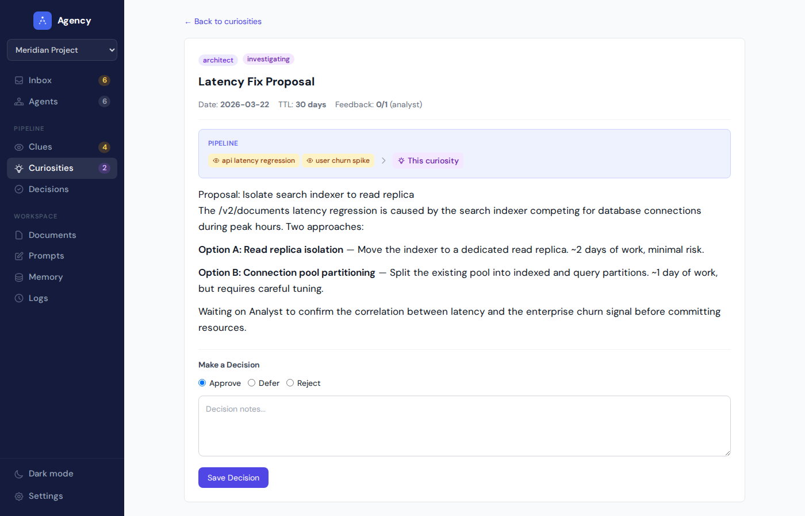
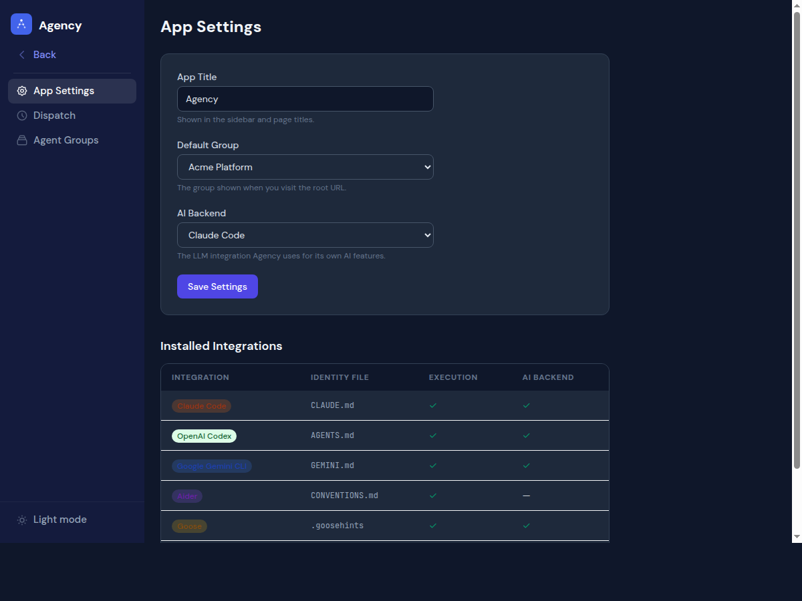

<p align="center">
  
</p>

<h1 align="center">Agency</h1>

<p align="center">
  The control plane for your AI agents — any LLM, any framework, your filesystem.
</p>

<p align="center">
  <strong>No database. No Docker. No build step.</strong> Python + FastAPI + Tailwind CDN.
</p>

---

<p align="center">
  
</p>

## Quick Start

```bash
pip install -e .
python -m agency.app
```

On first run, a setup wizard walks you through pointing Agency at your agent directory. It auto-detects agents by their identity files (`CLAUDE.md`, `AGENTS.md`, `GEMINI.md`, `.goosehints`, `agent.md`), creates the shared folder structure, and drops you into your Inbox.

Visit `http://localhost:8500`.

## How It Works

Your agents write observations to the filesystem as markdown files with YAML frontmatter. Agency reads those files and presents a pipeline:

1. **Clues** — agents observe something and write it down
2. **Curiosities** — observations converge into proposals worth considering
3. **Decisions** — you approve, defer, or reject through the UI
4. **Execution** — approved decisions auto-dispatch the proposing agent to do the work, with status tracking and retry

Every item in the pipeline links to its upstream and downstream neighbors, so you can trace how an observation became an action.

<p align="center">
  
</p>

## Why "Clues and Curiosities"?

Agency's observation pipeline is inspired by the knowledge-driven exploration design in [Outer Wilds](https://www.youtube.com/watch?v=vGnce1Dp9BU), as described by designer Alex Beachum at GDC.

In Outer Wilds, **curiosities** are the mysteries worth solving, and **clues** are the scattered observations that reveal them. Knowledge is the only tool — there are no upgrades, no collectibles, no quest markers. You explore because something caught your attention, follow the thread, and the connections between clues lead you to understanding.

Agency applies this framework to AI agent management:

- **Clues** are individual agent observations — things they noticed that might matter. Every clue must contain actionable information, not just background noise.
- **Curiosities** emerge when clues converge into something worth investigating. They represent the question an agent is asking, not the answer.
- **The pipeline** connects clues to curiosities to decisions, the same way Outer Wilds' ship log connects discoveries into a knowledge web. You can trace any decision back to the observations that prompted it.
- **Knowledge is the reward.** Agents don't collect points or complete checklists. They surface what they find, and the human decides what matters.

The result is a system where agents explore autonomously, surface what's interesting, and the human stays in the loop through curiosity rather than obligation.

## Multi-LLM Support

Agency works with any LLM tool through a plugin integration system. Each agent declares which integration it uses, and different agents in the same group can use different tools.

| Integration | Identity File | What It Does |
|-------------|-------------|-------------|
| **Claude Code** | `CLAUDE.md` | `claude --dangerously-skip-permissions -p` |
| **OpenAI Codex** | `AGENTS.md` | `codex exec --yolo` |
| **Google Gemini** | `GEMINI.md` | `gemini -p` |
| **Aider** | `CONVENTIONS.md` | `aider --message-file` |
| **Goose** | `.goosehints` | `goose run` |
| **Custom Script** | `agent.md` | Your command with `{prompt_file}` placeholder |
| **SDK** | `agent.md` | No execution — Agency manages files, you run the agent |

<p align="center">
  
</p>

```yaml
# config.yaml — mix integrations in the same group
groups:
  my-project:
    default_integration: claude-code
    agents:
    - researcher              # uses group default (Claude Code)
    - name: data-bot
      integration: codex      # uses Codex
    - name: runner
      integration: script     # uses a custom script
      integration_config:
        command: "./run.sh {prompt_file}"
```

## Features

- **Multi-LLM integrations** — Claude Code, Codex, Gemini, Aider, Goose, custom scripts, or SDK-only
- **Dispatch scheduling** — cross-platform (Linux systemd, macOS launchd), `at` and `every` rules per agent
- **Agent profiles** with identity, activity timeline, integration badge, and health monitoring
- **Inbox** that surfaces what needs your attention across all agents
- **Pipeline tracking** with clickable clue/curiosity/decision chains and auto-execution on approval
- **TTL enforcement** that auto-archives stale items
- **Document, memory, and prompt editing** in the browser
- **Light/dark mode** with system preference detection and persistent toggle
- **Multi-group support** for separate agent teams with different tools
- **Admin panel** for managing groups, agents, integrations, dispatch, and AI backend selection

<p align="center">
  
</p>

## Admin & Settings

The admin panel lets you manage groups, configure default integrations, and see all installed integration plugins at a glance.

<p align="center">
  
</p>

## Add-on: Agency Setup Skill

Agency ships with a [Claude Code skill](skills/agency-setup/) that can bootstrap a fully functional agent team for **any** codebase. If you use Claude Code, install the skill and run `/agency-setup` from any project directory.

### Install

```bash
# Symlink into your Claude Code skills directory
ln -s /path/to/agency/skills/agency-setup ~/.claude/skills/agency-setup
```

### What it does

1. **Analyzes** your codebase — language, framework, structure, purpose
2. **Proposes** 3-5 agents tailored to the project (you approve or tweak)
3. **Generates** everything Agency needs to manage them:
   - Agent role definitions and memory files
   - `shared/` folder with clues, curiosities, decisions, logs, prompts
   - Dispatch prompts with project-specific observation tasks
   - Tmux launch script with color-coded agent panes
4. **Registers** the new group with Agency (if Agency is installed)
5. **Enables** the dispatch timer so agents start running

## Tech Stack

Python 3.11+ / FastAPI / Jinja2 / Tailwind CSS CDN / No JS framework / No database

## Documentation

See the [`kb/`](kb/) folder:

- [Directory Structure](kb/directory-structure.md) — expected agent group layout
- [Agent Identity](kb/agent-identity.md) — display names, titles, avatars, integration detection
- [Data Formats](kb/data-formats.md) — clue, curiosity, and decision frontmatter
- [Configuration](kb/configuration.md) — config.yaml reference with per-agent integrations
- [Deployment](kb/deployment.md) — running as a service on Linux, macOS, or Windows
- [Dispatch](kb/dispatch.md) — cross-platform agent scheduling

## License

MIT
