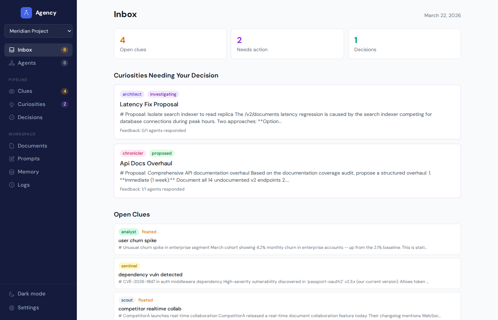
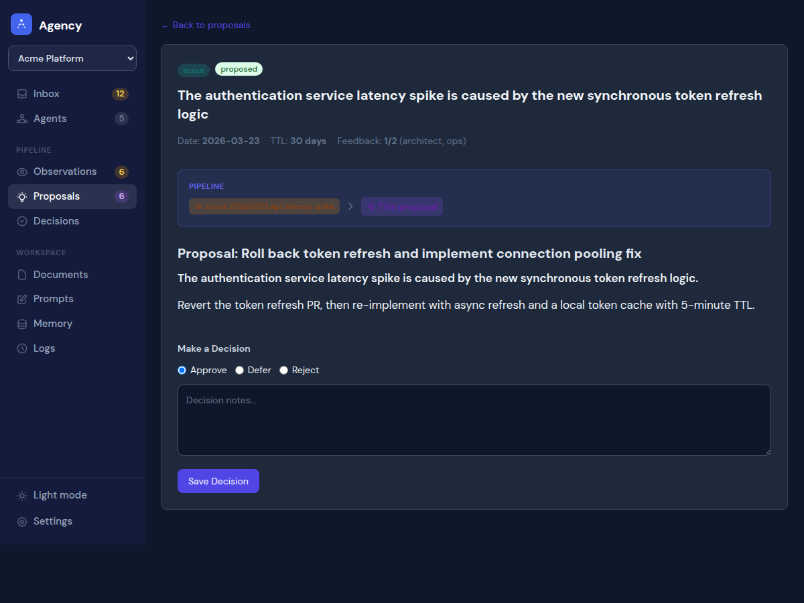
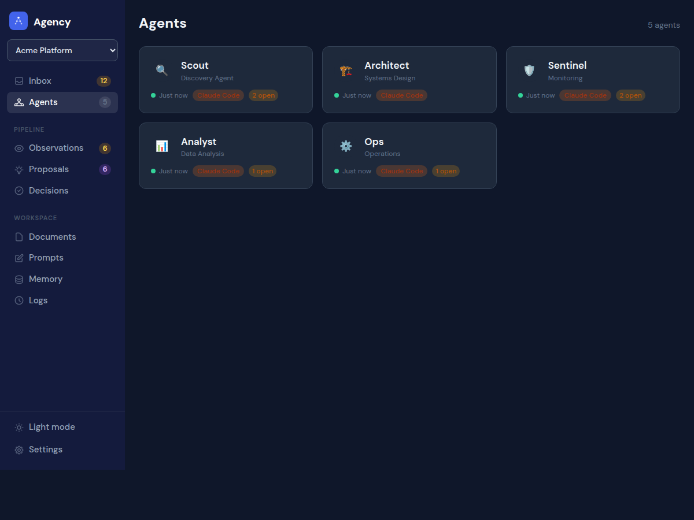
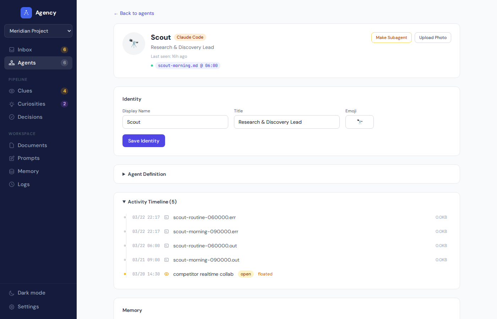

<p align="center">
  
</p>

<h1 align="center">Agency</h1>

<p align="center">
  One dashboard for all your AI agents — no matter what tool they run on.
</p>

<p align="center">
  <a href="https://github.com/christag/agency/blob/master/LICENSE"></a>
  
  
  
  
</p>

---

Agency is an open-source management dashboard for AI agent teams. It connects to 9 LLM tools — Claude Code, Codex, Gemini, Aider, Goose, OpenCode, Pi, custom scripts, and SDK agents — and gives you a unified pipeline to see what your agents observe, review their proposals, and make decisions. It currently manages 21 agents across 3 groups in production. Everything is stored as markdown files with YAML frontmatter. No database, no Docker, no build step. 229 tests passing.

<p align="center">
  
</p>

## Who is this for?

Agency is for people who treat AI agents like team members on a project — not disposable tools you spin up and throw away.

If you have a codebase where an agent handles docs, another watches for quality issues, and a third manages releases, those agents need persistent identities, accumulated knowledge, and a structured way to surface what they've found. Agency gives them that. Each agent has a name, a role, a memory, and a history. They live in your project long-term, like virtual employees with specific responsibilities.

**This is not an agent runner.** Tools like [Superset](https://superset.sh) are great at spinning up parallel workspaces, streaming real-time output, and managing active coding sessions. Agency sits above that layer. It's the coordination brain — deciding *what* agents should work on, reviewing *what they found*, and keeping a record of *what was decided*. Agency dispatches intent. Your runner of choice executes it.

If you have multiple projects, each with their own agent team, Agency manages all of them from one dashboard. Same pipeline, same governance, separate groups.

## What problem does Agency solve?

You have AI agents. Maybe they use Claude Code. Maybe Codex, Gemini, Aider, OpenCode, Pi, or something custom. They run in different directories, produce output in different ways, and you're alt-tabbing between terminals to figure out what's happening.

Agency gives you a single place to see what your agents are doing, what they've found, and what they need from you.

## What do you get?

### A pipeline that turns agent noise into action

Agents write down what they notice. Agency organizes those observations into a pipeline:

1. **Observe** — an agent spots something and writes it down
2. **Propose** — observations converge into a proposal worth considering
3. **Decide** — you approve, defer, or reject right from the dashboard
4. **Execute** — approved decisions auto-dispatch the agent to do the work

Every item links to what came before and after, so you can always trace how an observation became an action.

<p align="center">
  
</p>

> Agency's pipeline is inspired by the ship log in Outer Wilds. [Read the design story.](kb/design-inspiration.md)

### A mission control dashboard

The home screen gives you everything at a glance: which agents are healthy, what's moving through the pipeline, what needs your attention right now, and recent activity across your fleet.

Approve, defer, or reject proposals inline — no clicking through to separate pages unless you want the details.

### Which LLM tools does it support?

Agency supports **Claude Code, OpenAI Codex, Google Gemini, Aider, Goose, OpenCode, Pi, custom scripts**, and an SDK mode for agents you run yourself. Different agents in the same group can use different tools — Agency handles the differences.

<p align="center">
  
</p>

### Agent profiles with personality

Each agent gets a profile page with a name, title, emoji avatar, optional headshot, activity timeline, and health status. You can see at a glance who's been active, who's gone quiet, and what each agent has been working on.

<p align="center">
  
</p>

### How does scheduling work?

Set agents to run on schedules — daily at a specific time, or every few hours. Agency installs a lightweight system timer (no Docker, no cron hacks) and handles the rest. Each run gets logged so you can see exactly what happened.

### Agent jobs

Scheduled prompts, manual prompt runs, approved decisions, and decision retries all create durable records under `<group>/shared/jobs/`. On Linux with a user systemd manager, each job runs as a transient user systemd service (`systemd-run --user`), which ensures the worker continues even if the Agency service itself is restarted. On other platforms (macOS, Windows) or when systemd is unavailable, jobs run as detached subprocesses. In both cases, stopping or restarting the dashboard does not stop running agents. Concurrent jobs for one agent are allowed, and proposal authors can set optional `execution_agent` frontmatter. Job records contain prompt snapshots and may contain operational paths; treat the group's `shared/` directory as private application data.

The systemd launch path has its own opt-in integration test, skipped by default since it requires a real Linux user systemd manager:

```
AGENCY_TEST_SYSTEMD=1 .venv/bin/python -m pytest tests/test_job_systemd_integration.py -v
```

### A CLI for terminal people

Everything you can do in the browser, you can do from the terminal:

```
agency inbox           # What needs your attention
agency status          # Fleet overview
agency approve <slug>  # Approve a proposal
```

### Edit everything in the browser

Agent definitions, memory files, dispatch prompts, shared knowledge — all editable directly in the dashboard. No need to SSH in or find the right file.

## Quick Start

```bash
python3 -m venv .venv
.venv/bin/pip install -e .
.venv/bin/christag-agency serve
```

On first run, a setup wizard walks you through pointing Agency at your agent directory. It auto-detects your agents, creates the shared folder structure, and drops you into your dashboard.

Visit `http://localhost:8500`.

For development, start the same server with reload enabled:

```bash
.venv/bin/christag-agency serve --reload
```

Reload mode watches project code, templates, static assets, themes, and `config.yaml`. Saving Agency runtime records under a group's `shared/` directory does not restart the server.

## Add-on: Agency Setup Skill

Agency ships with a skill that can bootstrap a full agent team for any project. Install it and run `/agency-setup` from any project directory — it works with any LLM tool Agency supports.

It analyzes your project (code, business operations, creative work — whatever it is), proposes 3-5 agents tailored to the project's actual domains, generates everything Agency needs (role definitions, shared folders, dispatch prompts, tmux config), and registers the group with your dashboard. Agent suggestions go beyond just "who writes code" — the skill looks at the full project lifecycle and proposes roles you wouldn't think to create yourself.

See [Setup Skill details](kb/setup-skill.md) for installation and what it creates.

## Tech Stack

Python 3.11+ / FastAPI / Jinja2 / Tailwind CSS CDN / No database / No build step / No Docker required

## Documentation

See the [`kb/`](kb/) folder for detailed guides:

- [Getting Started](kb/getting-started.md) — first-run walkthrough and basic concepts
- [Integrations](kb/integrations.md) — supported LLM tools and how they work together
- [Directory Structure](kb/directory-structure.md) — how agent groups are organized on disk
- [Agent Identity](kb/agent-identity.md) — display names, titles, avatars, and health monitoring
- [Data Formats](kb/data-formats.md) — observation, proposal, and decision file formats
- [Configuration](kb/configuration.md) — config.yaml reference
- [Dispatch](kb/dispatch.md) — agent scheduling system
- [Deployment](kb/deployment.md) — running as a service on Linux, macOS, or Windows
- [Contributing Integrations](kb/contributing-integrations.md) — how to add support for a new LLM tool

## Contributing

Contributions are welcome! Fork the repo, create a branch, and open a PR.

```bash
git clone https://github.com/christag/agency.git
cd agency
pip install -e .
python -m pytest tests/ -v
```

## License

AGPL-3.0 — free to use, modify, and distribute. All derivative works must remain open source under the same license. See [LICENSE](LICENSE) for details.
